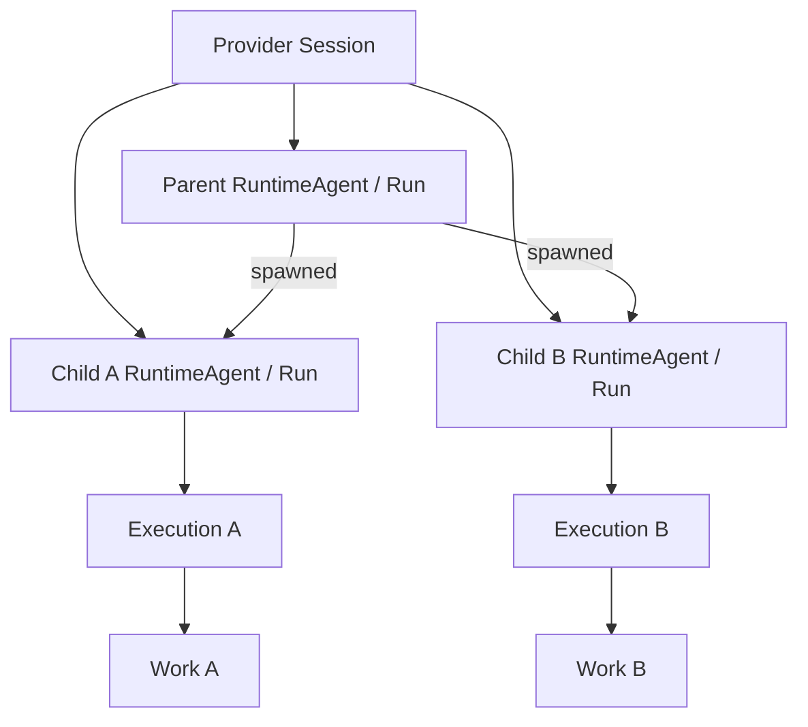

# Runtime hierarchy review and implementation

## 対象と結論

対象commit: `354c73d1e074ea3675b1c2352ae3af0130daebb9` (`mkusaka/wr`)

要求の正本は、このcommitの `next/docs/runtime-hierarchy-handoff.md`。
過去の会話にある旧handoffや、その後のmainではなく、指定commitの `next/src` と `next/test` を基準にした追加実装である。

変更は `next/` 内だけ。既存wrのCLI、D1、release、GitHub上のbranch、インストール済みhookは変更していない。
BunをNodeへ移行するpatchではない。Bun entrypoint、Bun SQLite、既存lock/dependencyを維持する。

実装したもの:

- Work hierarchy、runtime agent hierarchy、delegation、continuationを別々の関係にする。
- read-only orchestratorが担当scopeを分解し、子へ権限を委譲できる。
- trusted harnessからnative actorを観測・bindし、tool呼び出しごとに子専用contextを発行する。
- role、device、generation、要求版、委譲の有効性をauthorityで検査する。
- unassigned actorを親Executionへ帰属させない。
- 親終了、子の継続、orphan、quiescent、確定終了を区別する。
- work graphとは別にruntime treeを表示する。
- 新しいローカルprofileではauthorityをCLIが安全に自動起動・再利用する。

**現状:** Claudeのplain project hookでは、明示的に委譲したforeground・read-onlyのnative childを1つずつbindできる。生成hookを実行する実OSプロセスで、spawn相関、子専用Execution、tool context、完了、未割当childの観測と拒否まで確認した。
`NativeRuntimeBridge` は引き続き汎用のharness-side APIである。Codexはchild tool hookに`agent_id`がなく、OMPはtop-level extensionからspawnとchild identityを安定して対応付けられないため、両者のnative childは拒否する。
未完了なのは、実Claudeモデルによるchild起動の受入、Claudeのwritable・background・nested child、Codex/OMPのper-tool actor dispatchである。実Claude CLIのroot hook起動は確認したが、OAuth期限切れによりモデル呼出までは進まなかった。
したがって、native subagent全体を受入済みとはしない。対応範囲はClaudeの明示的なread-only childに限定する。

## 検証の区別

このdeliveryに含まれるNode互換コピーの検証記録は、変更前72テスト、修正前に失敗するsecurity regression 8件、修正後109テストを示している。統合時には正規のBun構成と実workerdで再検証した。

| 検証 | 結果 |
|---|---|
| 指定commitの元の72テスト | deliveryのNode互換コピーで72件成功 |
| 新しいsecurity regressionを修正前へ適用 | deliveryの記録では対象8件が失敗し、不具合を再現 |
| `bun run verify` | Bun 1.4.2で109件成功、失敗0。format、型検査、lint、demo、integrationを含む |
| `bun run test:workerd` | 実workerd、SQLite Durable Object、capability gatewayで成功 |
| 追加テスト数 | 37件 |
| 実native provider / live GitHub | 未実行 |
| 本番cutover | 未実行 |

既存 `test/domain.test.ts` のlifecycle呼出2箇所は、collectorからlauncherへ変更した。新しい権限境界に合わせたfixture修正であり、終了・fencing・rolloverのassertionは維持している。

この結果から主張できるのは、**Bun上の実装契約、ローカルprocess/SQLite/HTTP統合、workerd経路の成立**まで。実native runtimeや実運用の受入と混同しない。

### macOS統合時の修正

macOSの `ps -o lstart=` はlocaleによって表記が変わる。authority起動時と停止時のlocaleが異なると、同じPIDと開始時刻でも別processと誤判定し、安全な停止や再起動を妨げる。

`processIdentity` は `LC_ALL=C` を明示して開始時刻を取得する。PIDだけではなくlocale非依存の開始時刻も一致した場合に限り、既存authorityの停止・再起動を許可する。

## 1. 元実装で再現した不具合

行番号は修正前の指定commitのもの。

| 優先度 | 対象 | 元の挙動 | 修正 |
|---|---|---|---|
| P1 | `domain/service.ts:44-64`, `:207` | collector/launcherがworkerの状態変更を呼べる。collectorはruntime終了観測も通れる | commandとobservationのrole allowlistを入口で検査 |
| P1 | `domain/service.ts:330-338` | 発行元の親終了後も未使用delegationをredeemできる | 親のactive状態・generation・要求版・対象scopeをredeem時に再検査 |
| P1 | `server/app.ts` capability発行、`domain/service.ts:46-53` | 過去のstart操作再送で、停止済みExecution向けcapabilityを再発行できる | cache返却前のprincipal binding検査と、mint前のactive/generation/scope検査 |
| P1 | `domain/service.ts:338` | delegationがrole/modeを固定せず、受け手が選び直せる | grantでrole/modeを固定し、一致しないstartを拒否 |
| P2 | `domain/observations.ts:34-40` と `domain/service.ts` Session生成 | 同じexternal sessionを異なるhashキーで二重生成する | `sessionFor`で実provider identityを一意に再利用 |
| P2 | `domain/observations.ts:47-48` | ended Runへ遅れてunknownが届くと現在状態がunknownへ戻る | endedを終端にし、late observationは履歴として扱う |
| P1 | `domain/service.ts` aggregateのstart条件 | cancelledの親でもorchestratorとして起動できる | aggregate特例からterminal拒否を外さない |
| P1 | `domain/service.ts:207` | 終了workerが過去に作ったholdを解除できる | active・generation・対象bindingを再検査 |

最初のcollector回帰テストは複数操作を検査するが、修正前の実行は最初の不正なResult提出が通った時点で失敗する。
各操作がすべて独立した攻撃実演として記録された、と過大に解釈しない。

これらはrole capability間の認可不備である。OSユーザー自身が全credentialを読める環境を暗号学的に隔離したという主張ではない。

## 2. Handoffに追加した設計判断

### 2.1 native actorとprovider Sessionを分ける

原handoffは子に別Session/Run/Executionを求めているが、runtimeが同じprovider session内で複数agentを動かす場合、架空のexternal sessionを作らない。

- `Session`: 実providerが与えた会話identity。
- `RuntimeAgent`: root、直接親、provider agent ID、invocation IDを持つactor。
- `Run`: actor invocation。provider Sessionを共有してよい。
- `Execution`: そのRunが担当仕事へ取り組む記録。
- `Delegation`: 親Executionから対象仕事への着手権限。
- `continuedFrom`: 別attemptの継続。runtimeの親子ではない。



子A/BのRun・Execution・capabilityは別でも、provider Sessionは同じ場合がある。
`Session.parentSession`は診断情報。runtime treeの正本はRuntimeAgentの直接親であり、Sessionの共有から推定しない。

### 2.2 native childの観測と仕事へのbindingは別

`childStarted`を観測した事実は、claim成功と分ける。
権限失効・依存未解消などでbindに失敗しても、未割当childの観測は保持する。

```text
native child observed
  → RuntimeAgent + Run（Executionなし）
  → delegation / parent / scope / reservationを検査
  → bind成功時だけ専用Executionとcapability
```

未割当childに親capabilityを返すfallbackはない。

### 2.3 仕事の選択とactor identityをLLMに自己申告させない

harnessは、spawn要求の対象仕事・委譲tokenと、runtimeが返すchild identityを対応付ける。
tool dispatcherはruntime側の実caller identityから `toolEnvironment(actor)` を呼ぶ。
LLMがtool引数に任意のactor IDを書いて他人の権限を取得できる構成は禁止。

その境界が取得できないruntimeは未対応とする。cwd、最新child、agent_type、prompt内容から埋めない。

### 2.4 Stopと確定終了は別

Claude公式hooksではSubagentStopは「応答が終わった」通知であり、停止をブロックして続行させることもできる。
そのためStopを即座にprocess終了・reservation解放へ変換しない。

- `quiescent`: 応答待機。Run/Execution/reservationを維持。
- `unknown`: 生存状態が未確認。
- `ended`: trusted harnessがtool/process終了を確認したもの。

親のendedで子を終了しない。子はorphan表示されるが、既に割り当てられた自分の仕事の提出は続けられる。
親のresumeで既存の子を新親へ自動付け替えしない。

### 2.5 計画権限はrole名だけでは与えない

必要条件:

```text
worker capability
+ active Execution
+ role=orchestrator
+ mode=read
+ 担当scopeの要求/前提が現在も有効
+ shadowではなくnext authority
```

できることは担当子孫の未着手仕事の作成・更新と、scope内部の依存変更。
operator hold、trusted Check、policy緩和、resource/capacity変更、migration、cutoverなどは不可。

自分が許可された分解で生じたscope変更だけは、そのcoordinator Executionへ反映する。
operatorによる別の要求変更をstatus読取やcredential取得で黙って追認しない。

初版の保守的制約:

- evidence policyを持つ仕事の分解でpolicyをchildrenへ弱めない。
- explicit resource宣言を持つ親の分解は、operatorの再計画・resource配分が必要。
- childは親laneを引き継ぐ。read-only coordinatorをworker lane枠に数えない。
- attempted/completed/cancelled childをworkerが再計画しない。

### 2.6 identity照会で計画revisionを増やさない

per-tool credential取得でworkspaceのplan revisionを毎回更新すると、無関係なplanが競合する。
`runtime.credentials`はidempotency receiptだけを保存し、Work/DAG/Eventのrevisionを進めない。

## 3. インターフェース

### 通常の人間・worker

新しいlocal profileは最初の通常commandでauthorityを自動起動する。

```sh
wr-next add "調査と実装"
wr-next run W1 --read-only --role orchestrator --runtime generic -- YOUR_AGENT
```

管理下のorchestratorではparent省略時に担当scopeを利用できる。

```sh
wr-next add "Aの実装"
wr-next add "Bの実装"
wr-next plan --file child-plan.json
wr-next status
```

子workerの操作は引き続きID不要。

```sh
wr-next report --progress "対象を修正した"
wr-next done --summary "結果を提出した"
```

仕事の図とagentの図は別command。

```sh
wr-next graph W1
wr-next agents
wr-next agents --format mermaid
wr-next authority stop
```

`generic` launcherからの子processは従来の明示的な `wr-next run CHILD -- ...` が使える。
それをnative subagentの対応実績と呼ばない。

### Trusted native harness向け

`src/runtime/native.ts`をharness側でimportする。モデルにbroker tokenを渡さない。

```ts
const bridge = await NativeRuntimeBridge.attach(operatorConnection, {
    work: "W1",
    runtime: "my-harness",
    externalSessionId: actualSessionId,
    agentId: actualRootAgentId,
    invocationId: actualInvocationId,
    environment: actualWorktree,
}, stableAttachOperationId);

// parentのscope限定capabilityでdelegation.issueを行い、得たtokenを
// harnessがこのchildのspawnに対応付けて保持する。LLMにbroker権限は渡さない。
const child = await bridge.childStarted(parentRuntimeAgentId, {
    externalSessionId: actualChildSessionId,
    agentId: actualChildAgentId,
    invocationId: actualChildInvocationId,
}, stableChildEventId, {
    delegationToken: assignedToken,
    environment: actualChildWorktree,
});

// 各toolを実行する直前に、runtimeのcaller identityでactorを選ぶ。
const childEnv = await bridge.toolEnvironment(child.runtimeAgent, baseEnvironment);
// このenvでtool subprocessを実行する。process.envの全体を上書きしない。

await bridge.lifecycle(child.runtimeAgent, "quiescent", stopEventId);
// tool/processが確実に停止した後だけ:
await bridge.lifecycle(child.runtimeAgent, "ended", exitEventId, { exitCode: 0 });
```

broker receiptはowner-privateに保存される。harness再起動時は `NativeRuntimeBridge.restore(receipt)` でroot/generationをauthorityと照合する。
root parentが既に終了していても、同じruntime root内の残存childを観測できる。
期限切れcapabilityの更新やcross-device broker移管を、このrestoreだけで実装済みとはしない。

未知のtool callerには `unboundToolEnvironment` を使う。親の `WR_NEXT_CONTEXT` やoperator設定へfallbackしない。

### Authority側の追加command

| command | 呼出元 | 役割 |
|---|---|---|
| `runtime.attach` | operator / 既存Executionのlauncher | wrapper不要のroot attach、またはwrapper Runとの接続 |
| `runtime.child` | root-scoped adapter | runtime childの観測 |
| `runtime.bind` | root-scoped adapter | exact-parent delegationを子へbind |
| `runtime.credentials` | root-scoped adapter | その子に限定したtool context用credential |
| `runtime.lifecycle` | adapter、observation入口 | actor単位のlifecycle |
| `delegation.issue` / `delegation.revoke` | scoped orchestrator / operator | 発行と未claim grantの失効 |
| `GET /v1/runtime` | roleごとのscope | runtime tree |

`runtime.child`のraw APIは観測とbindの同時指定にも対応するが、推奨するbrokerは二段階で呼び、bind失敗時の観測を保持する。

## 4. Claude連携の挙動

明示的な委譲がないchildを親Executionへ推測で帰属させない、という原則は変えていない。

- 従来のwrapper event pathは、未対応の`Agent` / `Task` spawnを引き続き拒否する。
- plain agent-managed project hookは、`wr-next delegate REF --read-only`が返す`spawnDirective`を先頭に置いたforeground Agent/Taskだけを許可する。
- `PreToolUse`と`SubagentStart`を、同じ`prompt_id`、単一pending spawn、実`agent_id`で対応付ける。
- bind済みchildのtool hookには、`NativeRuntimeBridge`が発行した子専用contextを渡す。
- read-only childはClaudeの参照系toolと、限定したwr-next/Git参照commandだけを使える。
- 未割当childもRuntimeAgentとして観測するが、Executionは作らずtool実行を拒否する。
- `SubagentStop`はquiescentとして記録し、確定終了とは扱わない。
- writable、background、nested childと`SendMessage`は拒否する。

つまり、Claude native subagentを自由に使えるわけではない。現時点で使えるのは、明示的に委譲したforeground・read-only childだけである。通常の親仕事と、明示的な子`wr-next run`も引き続き利用できる。

hookを無効化できる同一OSユーザーや、モデルがoperator credentialへ自由にアクセスできる環境に対するsandboxではない。標準permissionを許可に上書きする`permissionDecision=allow`はClaudeには追加しない。


## 5. Local authorityの自動起動

毎回manual serveは要求しないが、異常時に別authorityを作って整合性を失うことも避ける。

- 初回起動はowner-privateのatomic mkdir lockで調停。
- 起動receiptはPIDだけでなくprocess start identityを持つ。
- 既存profileの認証済み応答があるなら再利用。
- 同じprocessが生存しているのに応答しない場合、二重起動しない。
- 認証失敗、別サービス応答、unknown database、未解決startup lockでは停止。
- restart時も同じdatabase/workspace/device/secretを使う。
- remote接続失敗をlocal新規DBへfallbackしない。
- 管理下worker、hook、未割当native toolからauthorityを起動・停止・接続変更しない。
- `authority stop`は認証とprocess fingerprintを確認して対象processだけ止める。

旧manual接続profileにdatabase/process記録がない場合は、今回勝手に推定して移行しない。
そのprofileでは一度明示的なserveが必要。新profileまたは今回版serveが記録したprofileから自動管理できる。
起動直後にreceipt確定前のcrashが起きた場合は、lock/receiptを残し、無条件再spawnしない。

## 6. 保存と既存記録の移行

`Store`へschema version 2を追加。RuntimeAgent用table/indexを足す。
過去のWork/Run/Execution/Result/Acceptance/Eventを削除・再帰属しない。
旧Session親子から新RuntimeAgentを推測生成しない。以前の重複Sessionを破壊的mergeもしない。

安全性のため、旧credential/receiptに関して以下の変更がある。

- 新capabilityはdevice・generation・runtime bindingを含む。
- 古い形式の未claim delegationは再発行が必要。
- v1のoperation fingerprintの再送は `LEGACY_OPERATION_REPLAY` で停止する。
  既存結果を確認してから再試行する。新operationIdへ自動変更して外部副作用を再実行しない。
- 停止・回収後のcached launch replayから新capabilityを発行しない。

適用前にwr-nextのauthorityを停止し、新実装自身のSQLiteとconfig/stateをバックアップすること。
これは既存wrのD1 migrationではない。
古いbinaryへ戻す際は、新schemaを古いbinaryで開くより、停止後のbackup復元を用いる。

## 7. Handoff受入条件との対応

| 条件 | 今回 |
|---|---|
| 親がscope内だけを分解できる | 実装・回帰テスト済み |
| 二つの子をnativeへ並列委譲 | authority/broker契約テスト済み。実provider未接続 |
| 子のSession/Run/Execution/capability | RuntimeAgent/Run/Execution/capabilityは分離。実Sessionは共有可能 |
| 子Aのreport/done誤帰属防止 | 実HTTP・別CLI processを含む合成native testで確認 |
| 継承した親envから更新しない | per-tool dispatchのunbound guardとClaude wrapper guard。harness注入必須 |
| 子終了・親終了・orphan・resume | 実装・契約テスト済み |
| 孫への委譲 | 実装・契約テスト済み |
| 子AcceptanceからWork親集約 | 既存policyを使いテスト済み |
| agent treeとWork graphの別表示 | 実装・テスト済み |
| 実runtime CLIで上記を検証 | **未実施、未受入** |

追加で、legacy migration/importerの全面対応、runtime自律dispatch、完全Web UI、Access OAuth更新、旧wr移行、本番deployは行っていない。

## 8. 再現と適用

patchは指定commitのsource/test blobを基準にしている。`next/`全体を古い配布ZIPへ戻すものではない。
配布ZIP内の `overlay/` は変更ファイルだけであり、完全なリポジトリではない。

```sh
git switch -c feat/wr-next-runtime-hierarchy 354c73d1e074ea3675b1c2352ae3af0130daebb9
git apply --check /path/to/wr-next-354c73d-runtime-hierarchy.patch
git apply /path/to/wr-next-354c73d-runtime-hierarchy.patch
cd next
bun ci
bun run verify
bun run test:workerd
```

本番deploy・旧wr差し替え・GitHubへのpush/mergeは含まない。
実Claude native対応の確認を合成テストで代替しない。

## 出所

ソースとhandoff:

```text
https://github.com/mkusaka/wr/commit/354c73d1e074ea3675b1c2352ae3af0130daebb9
https://github.com/mkusaka/wr/blob/354c73d1e074ea3675b1c2352ae3af0130daebb9/next/docs/runtime-hierarchy-handoff.md
```

公式仕様を確認した点: tool hookのagent_id、SubagentStartのblocking制限、SubagentStopの意味。

```text
https://code.claude.com/docs/en/hooks
```

上記以外の新model、scoped planning規則、broker、unknownの扱い、auto authority、migration上の拒否は、このレビューによる実装判断。
原handoffにそのまま書かれていた既存仕様と混同しない。
